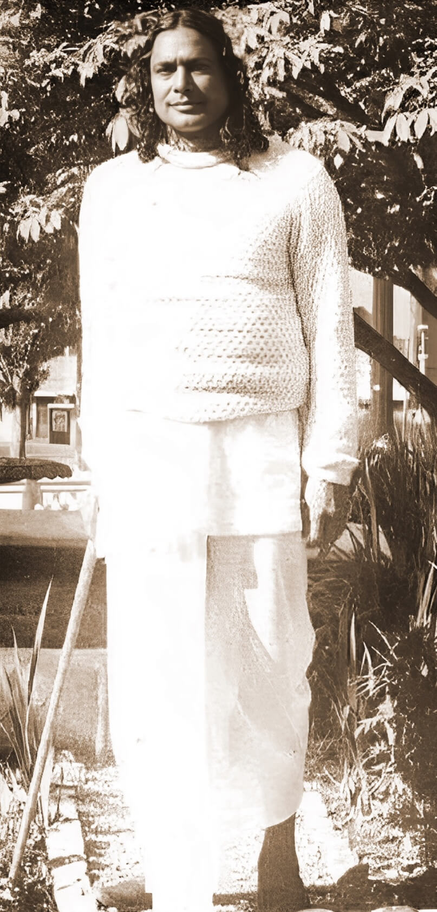
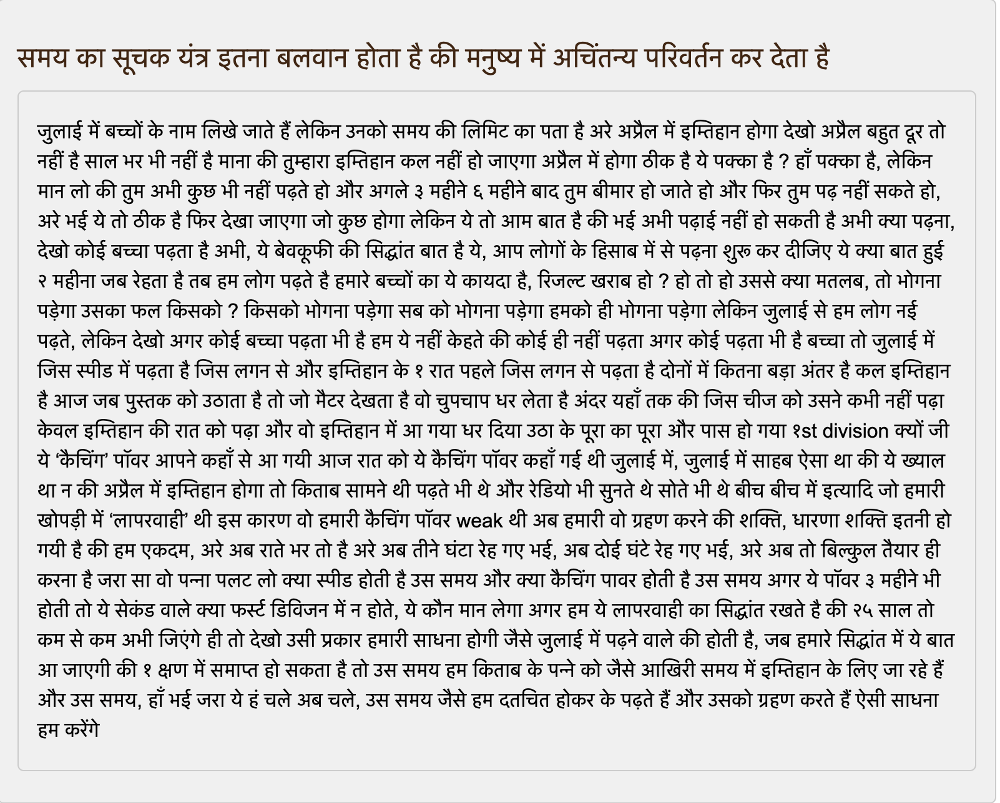

# Kripalu real word examples
Real world examples by Jagadguru Kripalu Maharaj that explain deep spiritual concepts in layman terms(**gaddhe ki akal se samjho**) derived from his lecture series.

## Features

* Organized by topics/sub-topics: Real world examples are grouped under the specific topic and sub-topic from which it was derived, allowing for easy navigation and context.
* Simple Design: The website is designed for easy readability and browsing, with key focus on the content.

## Access the Real Examples explaining spiritual concepts

You can explore the collection directly [here](https://kishoriji.github.io/kripalu_real_word_examples).

Here is a preview of the content, highlighting the  **importance of deadline**

## Contributing

We welcome contributions! If you have additional examples from Kripalu Maharaj’s lectures or suggestions for improvement, please feel free to open a pull request or submit an issue.